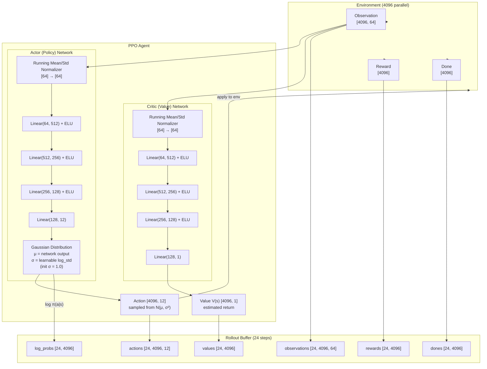
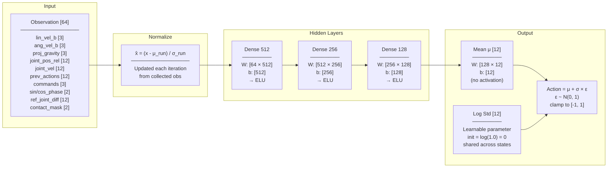
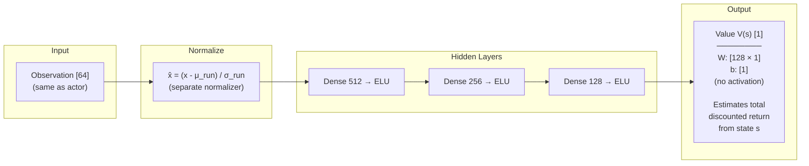
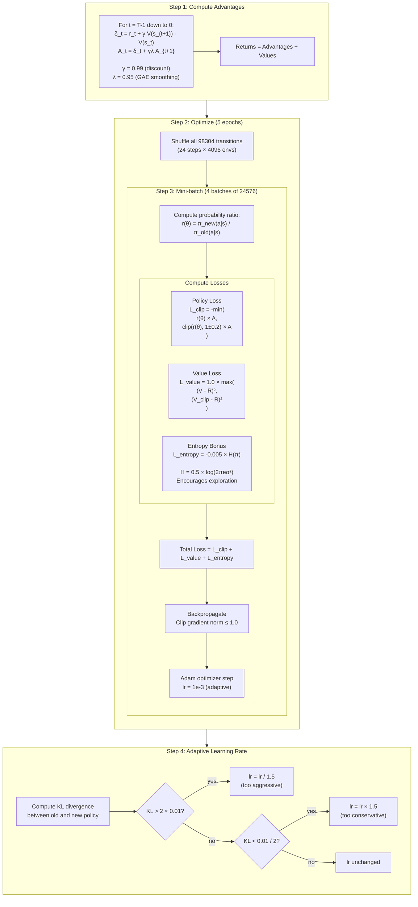
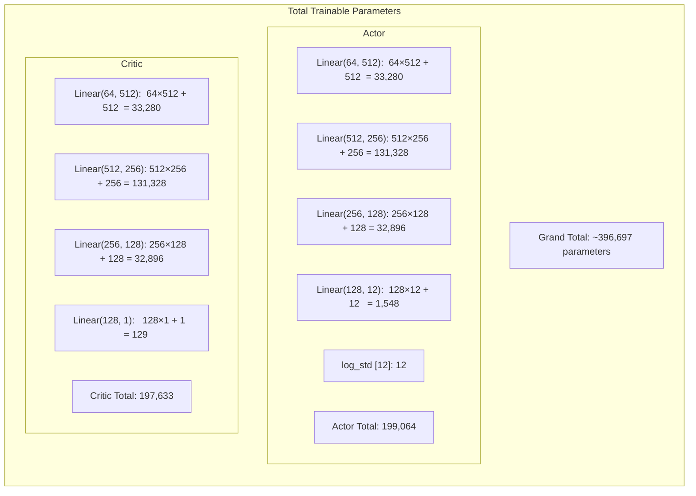
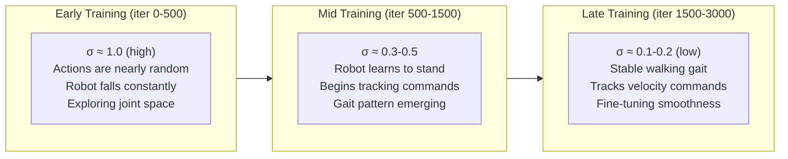

# PPO Network Architecture — PM01 Walking

## Full PPO System

## Actor Network Detail

## Critic Network Detail

## PPO Update Algorithm

## Parameter Count

## Training Timeline

```mermaid
gantt
    title PM01 Walking Training (3000 iterations)
    dateFormat X
    axisFormat %s

    section Data Collection
    24 steps × 4096 envs    :a1, 0, 24

    section PPO Update
    GAE computation          :a2, after a1, 1
    Epoch 1 (4 mini-batches) :a3, after a2, 4
    Epoch 2 (4 mini-batches) :a4, after a3, 4
    Epoch 3 (4 mini-batches) :a5, after a4, 4
    Epoch 4 (4 mini-batches) :a6, after a5, 4
    Epoch 5 (4 mini-batches) :a7, after a6, 4

    section Next Iteration
    Collect again            :a8, after a7, 24
```

## How Action Noise Evolves

## Summary Table

| Component | Shape | Parameters | File |
|-----------|-------|------------|------|
| Actor input | [64] | - | `armrobotlegging_env_cfg.py` |
| Actor hidden | [512, 256, 128] | 197,504 | `rsl_rl_ppo_cfg.py` |
| Actor output (μ) | [12] | 1,548 | `rsl_rl_ppo_cfg.py` |
| Actor log_std | [12] | 12 | RSL-RL (init_noise_std=1.0) |
| Critic hidden | [512, 256, 128] | 197,504 | `rsl_rl_ppo_cfg.py` |
| Critic output (V) | [1] | 129 | RSL-RL |
| Obs normalizer | μ,σ [64] each | - (not trainable) | RSL-RL (empirical) |
| **Total trainable** | | **~396,697** | |
| Rollout buffer | 24 × 4096 | 98,304 transitions | `rsl_rl_ppo_cfg.py` |
| Training iterations | 3000 | ~295M env steps | `rsl_rl_ppo_cfg.py` |
