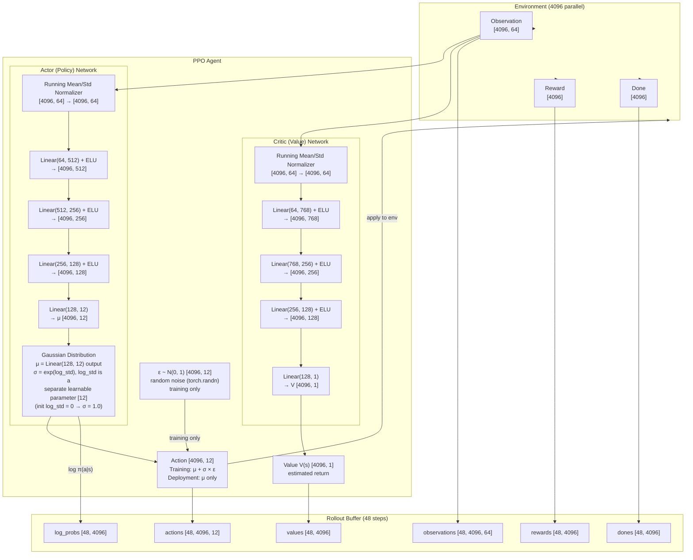
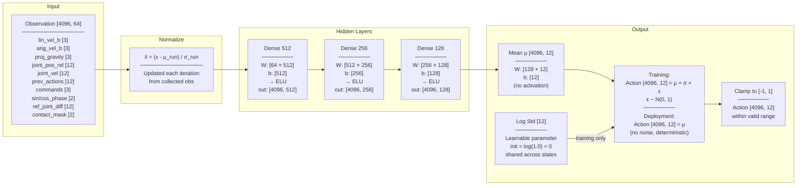
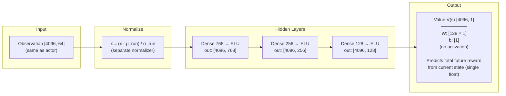
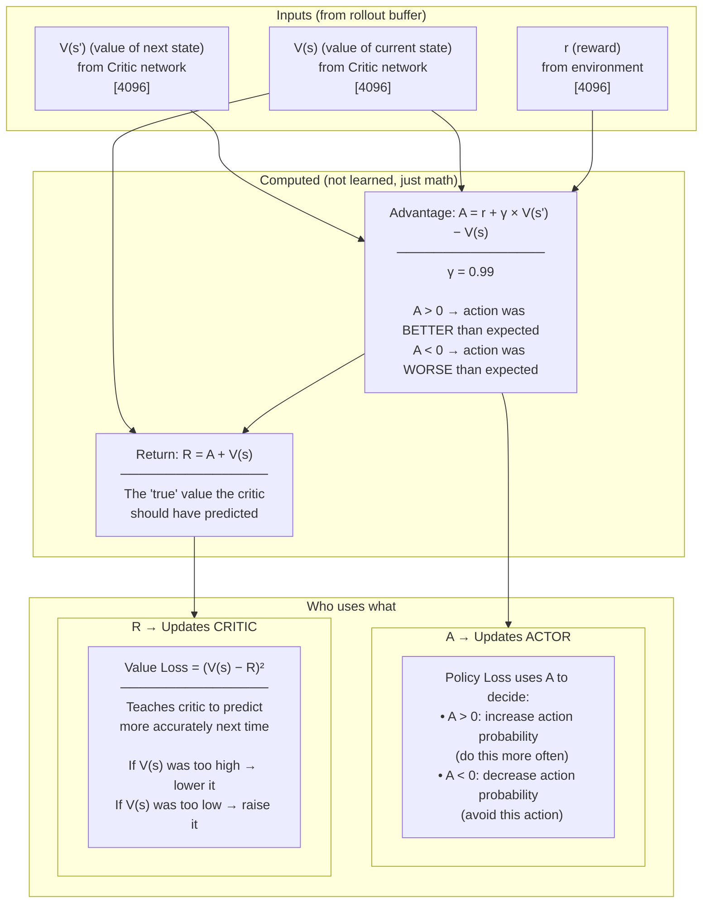
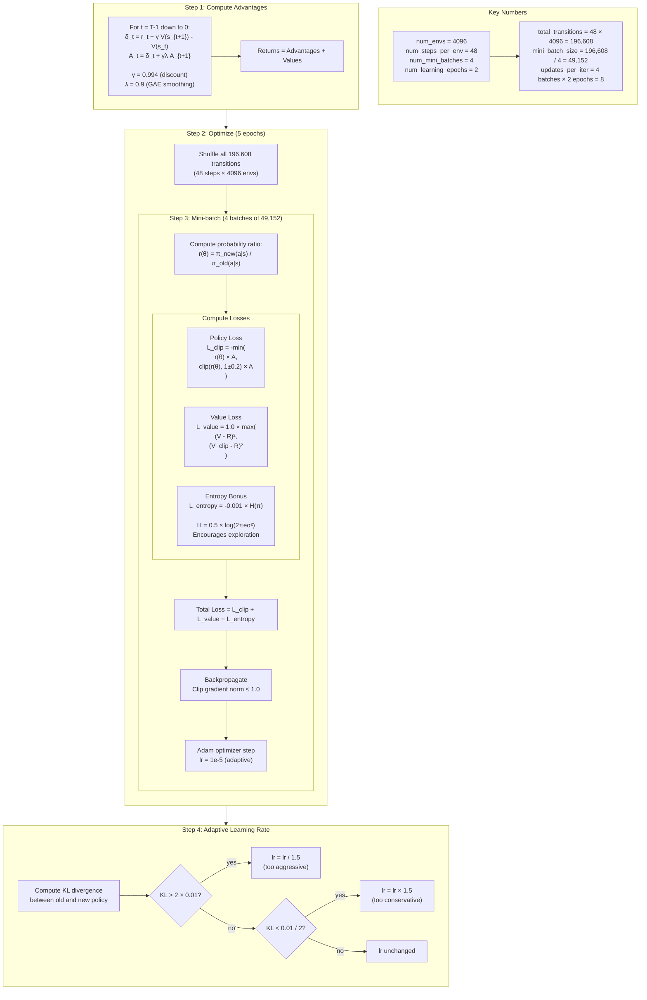
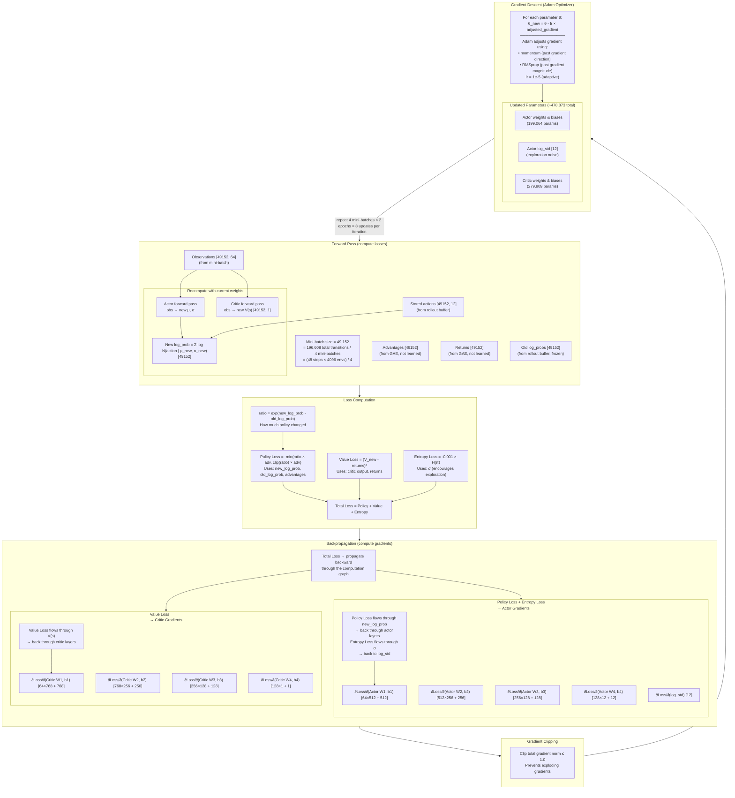
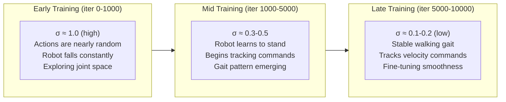

# PPO Network Architecture — PM01 Walking

## Full PPO System



## Actor Network Detail



## Critic Network Detail



## How Critic V(s) Connects to Actor Training



## PPO Update Algorithm



## Backpropagation & Gradient Descent



### What drives the learning

| Signal | Source | Affects | How |
|--------|--------|---------|-----|
| **Advantages** | GAE from rewards + critic values | Actor weights | Positive advantage → increase action probability, negative → decrease |
| **Returns** | GAE from rewards | Critic weights | Critic learns to predict total future reward more accurately |
| **Entropy** | Current σ (log_std) | log_std parameter | Prevents σ from collapsing to 0 too early (keeps exploring) |
| **Gradient clipping** | All gradients | All weights | Caps update magnitude to prevent training instability |
| **Adaptive LR** | KL divergence | Learning rate | Slows down if policy changes too fast, speeds up if too slow |

### What is NOT learned (frozen during update)

| Value | Why frozen |
|-------|-----------|
| Old log_probs | Snapshot of policy at collection time — needed for ratio |
| Advantages | Computed once from rewards, not differentiable |
| Returns | Target for critic, computed from rewards |
| Actions in buffer | Already taken, can't change them |
| Observations | Came from environment, not from policy |

## Parameter Count


## Training Timeline

```mermaid
gantt
    title PM01 Walking Training (10000 iterations)
    dateFormat X
    axisFormat %s

    section Data Collection
    48 steps × 4096 envs    :a1, 0, 48

    section PPO Update (2 epochs)
    GAE computation          :a2, after a1, 1
    Epoch 1 (4 mini-batches) :a3, after a2, 4
    Epoch 2 (4 mini-batches) :a4, after a3, 4

    section Next Iteration
    Collect again            :a5, after a4, 48
```



## How Action Noise Evolves



## Observation Vector Detail [64]

| Index | Dims | Name | Description | Source |
|-------|------|------|-------------|--------|
| 0–2 | 3 | `lin_vel_b` | Base linear velocity in body frame [m/s] | IMU / sim |
| 3–5 | 3 | `ang_vel_b` | Base angular velocity in body frame [rad/s] | IMU / sim |
| 6–8 | 3 | `projected_gravity` | Gravity vector in body frame (0,0,−1 when upright) | Quaternion transform |
| 9–20 | 12 | `joint_pos_rel` | Current leg joint positions minus default standing pose [rad] | Joint encoders |
| 21–32 | 12 | `joint_vel` | Leg joint velocities [rad/s] | Joint encoders |
| 33–44 | 12 | `prev_actions` | Previous policy output [−1, 1] | Action buffer |
| 45–47 | 3 | `commands` | Target velocity: [vx, vy, yaw_rate] | Command sampler |
| 48 | 1 | `sin_phase` | sin(2π × gait_phase) — gait clock | Gait generator |
| 49 | 1 | `cos_phase` | cos(2π × gait_phase) — gait clock | Gait generator |
| 50–61 | 12 | `ref_joint_diff` | Reference gait position minus current joint position [rad] | Gait generator |
| 62–63 | 2 | `contact_mask` | Left/right foot on ground [0 or 1] | Foot height check |
| | **64** | | | |

> Defined in `armrobotlegging_env.py` → `_get_observations()`
> Dimensions configured in `armrobotlegging_env_cfg.py` → `observation_space = 64`

## Action Vector Detail [12]

| Index | Joint | Side | Description |
|-------|-------|------|-------------|
| 0 | `j00_hip_pitch_l` | Left | Hip forward/backward |
| 1 | `j01_hip_roll_l` | Left | Hip side-to-side |
| 2 | `j02_hip_yaw_l` | Left | Hip rotation |
| 3 | `j03_knee_pitch_l` | Left | Knee bend |
| 4 | `j04_ankle_pitch_l` | Left | Ankle forward/backward |
| 5 | `j05_ankle_roll_l` | Left | Ankle side-to-side |
| 6 | `j06_hip_pitch_r` | Right | Hip forward/backward |
| 7 | `j07_hip_roll_r` | Right | Hip side-to-side |
| 8 | `j08_hip_yaw_r` | Right | Hip rotation |
| 9 | `j09_knee_pitch_r` | Right | Knee bend |
| 10 | `j10_ankle_pitch_r` | Right | Ankle forward/backward |
| 11 | `j11_ankle_roll_r` | Right | Ankle side-to-side |

Each action value is in **[−1, 1]**, converted to joint target:
```
target = default_joint_pos + 0.5 × action
```

> Defined in `armrobotlegging_env_cfg.py` → `leg_joint_names` and `action_scale = 0.5`
> Applied in `armrobotlegging_env.py` → `_apply_action()`

## Summary Table

| Component | Shape | Parameters | File |
|-----------|-------|------------|------|
| Actor input | [64] | - | `armrobotlegging_env_cfg.py` |
| Actor hidden | [512, 256, 128] | 197,504 | `rsl_rl_ppo_cfg.py` |
| Actor output (μ) | [12] | 1,548 | `rsl_rl_ppo_cfg.py` |
| Actor log_std | [12] | 12 | RSL-RL (init_noise_std=1.0) |
| Critic hidden | [768, 256, 128] | 279,680 | `rsl_rl_ppo_cfg.py` |
| Critic output (V) | [1] | 129 | RSL-RL |
| Obs normalizer | μ,σ [64] each | - (not trainable) | RSL-RL (empirical) |
| **Total trainable** | | **~478,873** | |
| Rollout buffer | 48 × 4096 | 196,608 transitions | `rsl_rl_ppo_cfg.py` |
| Training iterations | 10000 | ~1.97B env steps | `rsl_rl_ppo_cfg.py` |
