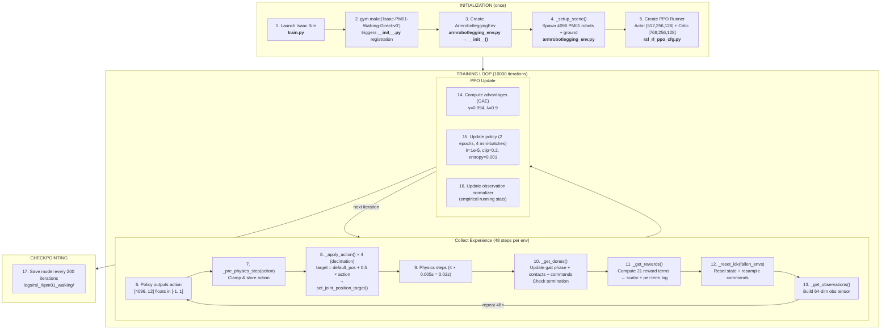
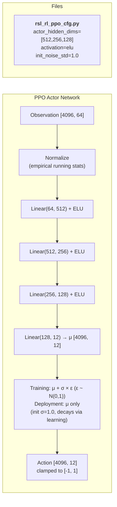
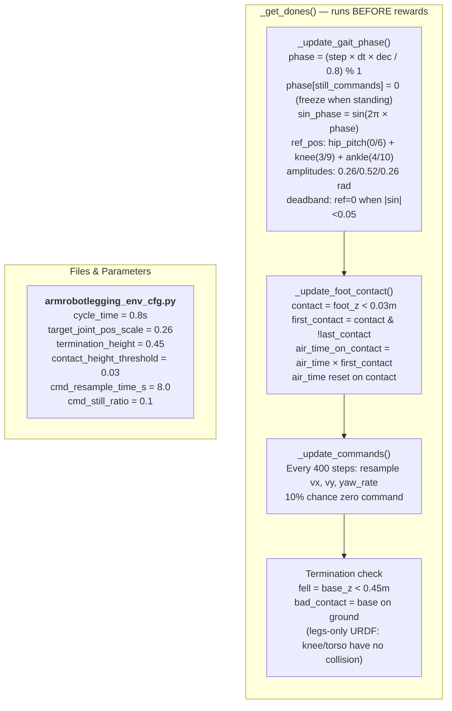
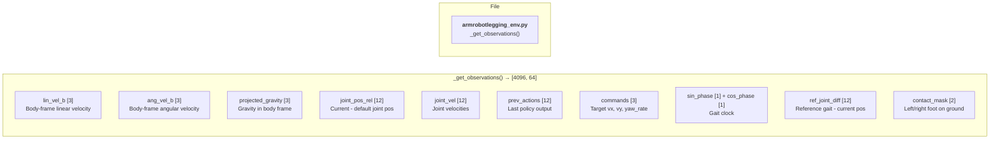
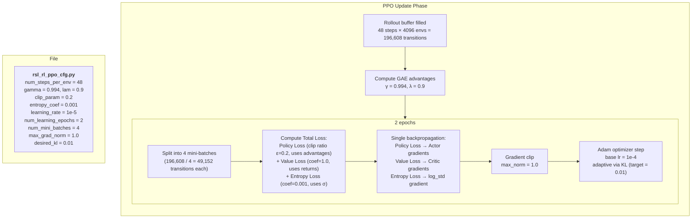
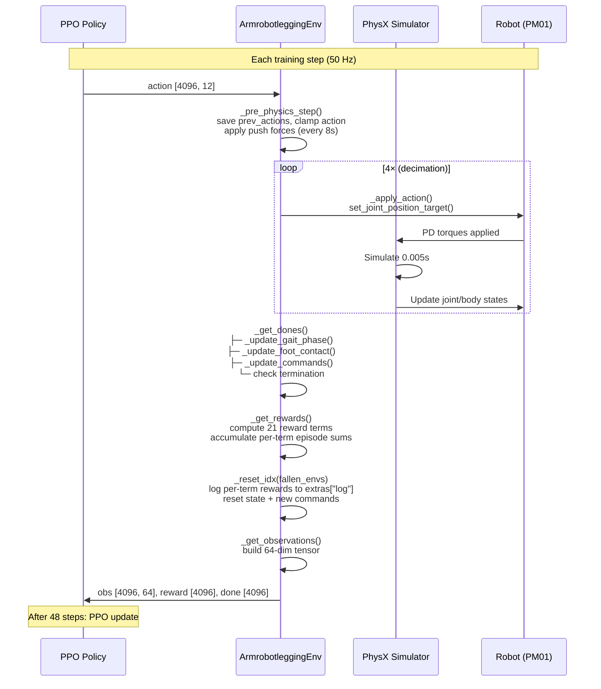

# PM01 Walking — Training Flow

## High-Level Training Loop



## Detailed Step-by-Step with Parameters

### Phase 1: Action Generation



### Phase 2: Action Application (per physics sub-step)


### Phase 3: State Update & Gait Phase



### Phase 4: Observation Construction



### Phase 5: Reward Computation

```mermaid
flowchart TB
    subgraph REWARDS["compute_rewards() → scalar per env"]
        direction TB

        subgraph POS["Positive rewards (clamped ≥ 0)"]
            R1["tracking_lin_vel = 1.4 × exp(-error²/5.0)<br/>Match commanded vx, vy"]
            R2["tracking_ang_vel = 1.1 × exp(-error²/5.0)<br/>Match commanded yaw rate"]
            R3["ref_joint_pos = 2.2 × exp(-2 × mean(diff²))<br/>Follow gait reference (MEAN over joints)"]
            R4["feet_air_time = 1.5 × Σ(air_time - 0.5) × first_contact<br/>Reward proper swing duration<br/>(gated: zero when cmd < 0.1)"]
            R5["feet_contact_number = 1.4 × mean(match)<br/>Correct stance/swing per phase"]
            R6["orientation = 1.0 × exp(-roll_pitch_err × 10)<br/>Stay upright"]
            R7["base_height = 0.2 × exp(-height_err × 100)<br/>Maintain 0.8132m"]
            R8["vel_mismatch = 0.5 × (low_z_vel + low_xy_angvel)<br/>Minimize parasitic motion"]
            R9["alive = 0.05<br/>Survival bonus"]
            R12["default_joint_pos = 0.8 × (exp(-hip_dev×100) - 0.01×norm)<br/>Keep hip pitch/roll near default"]
            R13["feet_distance = 0.2 × exp(-deviation×100)<br/>Keep feet within [0.15m, 0.8m]"]
            R_TVH["track_vel_hard = 0.5 × (exp(-err×10) - 0.2×err)<br/>Sharp velocity tracking (forces locomotion)"]
            R_LS["low_speed = 0.2 × discrete(-1/+2/-2)<br/>Punish too slow, reward good speed"]
            R_LV["lat_vel = 0.3 × exp(-lat_error²×10)<br/>Lateral velocity tracking"]
        end

        CLAMP["torch.clamp(sum, min=0.0)"]

        subgraph NEG["Penalties (always applied)"]
            R10["action_smoothness = -0.003 × (term1 + term2 + term3)<br/>term1: (a_t - a_{t-1})²<br/>term2: (a_t + a_{t-2} - 2×a_{t-1})² (2nd-order)<br/>term3: 0.05 × |a_t|"]
            R11["energy = -0.0001 × Σ(action² × |vel|)<br/>Efficiency"]
            R14["feet_clearance = -1.6 × norm(swing_target - foot_height)<br/>Force swing foot to lift"]
            R15["foot_slip = -0.1 × Σ(√foot_speed × contact)<br/>Penalize sliding on ground"]
            R16["termination = -1.0 × fell<br/>Fall penalty"]
            R17["track_vel_hard = 0.5 × (exp(-err×10) - 0.2×err)<br/>Sharp velocity tracking"]
            R18["low_speed = 0.2 × discrete(-1/+2/-2)<br/>Punish too slow, reward good speed"]
            R19["dof_vel = -1e-5 × Σ(joint_vel²)<br/>Penalize joint velocities (anti-vibration)"]
            R20["dof_acc = -5e-9 × Σ((Δvel/dt)²)<br/>Penalize joint accelerations (CRITICAL anti-vibration)"]
            R21["lat_vel = 0.3 × exp(-lat_error² × 10)<br/>Lateral velocity tracking (prevents sideways drift)"]
        end

        POS --> CLAMP --> NEG
    end

    subgraph FILES5["Files & Parameters"]
        F5["<b>armrobotlegging_env_cfg.py</b><br/>All rew_* parameters<br/><b>armrobotlegging_env.py</b><br/>compute_rewards()"]
    end
```



### Phase 6: PPO Update



## Complete Parameter Map

### Where every parameter lives

```
┌─────────────────────────────────────────────────────────────────┐
│                        train.py                                  │
│  --task Isaac-PM01-Walking-Direct-v0                            │
│  --num_envs 4096                                                 │
│                                                                  │
│  ┌───────────────────────────────────────────────────────────┐  │
│  │              __init__.py (gym registration)               │  │
│  │  entry_point → ArmrobotleggingEnv                         │  │
│  │  env_cfg     → ArmrobotleggingEnvCfg                      │  │
│  │  agent_cfg   → PM01WalkingPPORunnerCfg                    │  │
│  └───────────────────────────────────────────────────────────┘  │
│                                                                  │
│  ┌─────────────────────┐  ┌────────────────────────────────┐   │
│  │  armrobotlegging_    │  │  rsl_rl_ppo_cfg.py             │   │
│  │  env_cfg.py          │  │                                │   │
│  │                      │  │  Network:                      │   │
│  │  SIMULATION:         │  │    [512, 256, 128] ELU         │   │
│  │    dt = 1/200        │  │    noise_std = 1.0             │   │
│  │    decimation = 4    │  │    obs normalization = True    │   │
│  │                      │  │                                │   │
│  │  SPACES:             │  │  PPO:                          │   │
│  │    action = 12       │  │    γ = 0.994, λ = 0.9         │   │
│  │    obs = 64          │  │    lr = 1e-5 (adaptive)        │   │
│  │                      │  │    clip = 0.2                  │   │
│  │  GAIT:               │  │    entropy = 0.001             │   │
│  │    cycle = 0.8s      │  │    epochs = 2                  │   │
│  │    scale = 0.26 rad  │  │    mini-batches = 4            │   │
│  │                      │  │    steps/env = 48              │   │
│  │  COMMANDS:            │  │    max_iterations = 10000      │   │
│  │    vx: [-1, 1] m/s   │  │                                │   │
│  │    vy: [-0.3, 0.3]   │  └────────────────────────────────┘   │
│  │    yaw: [-1, 1] rad/s│                                       │
│  │    resample: 8s       │  ┌────────────────────────────────┐   │
│  │    still: 10%         │  │  pm01.py (robot config)        │   │
│  │                      │  │                                │   │
│  │  REWARDS:             │  │  PD Gains:                     │   │
│  │    lin_vel: 1.4       │  │    hip_pitch: Kp=70, Kd=7     │   │
│  │    ang_vel: 1.1       │  │    knee: Kp=70, Kd=7          │   │
│  │    ref_pos: 2.2       │  │    ankle: Kp=20, Kd=0.2       │   │
│  │    air_time: 1.5      │  │                                │   │
│  │    contact: 1.4       │  │  Effort limits:                │   │
│  │    orient: 1.0        │  │    hip: 164 Nm                 │   │
│  │    height: 0.2        │  │    knee: 164 Nm                │   │
│  │    vel_mis: 0.5       │  │    ankle: 52 Nm                │   │
│  │    alive: 0.05        │  │                                │   │
│  │    smooth: -0.003     │  │  Init: 0.9m, knees bent        │   │
│  │    energy: -0.0001    │  │  URDF: pm01_only_legs_simple_   │   │
│  │        collision.urdf           │   │
│  │    clearance: -1.6    │  │                                │   │
│  │    default_pos: 0.8   │  │                                │   │
│  │    feet_dist: 0.2     │  │                                │   │
│  │    foot_slip: -0.1    │  │                                │   │
│  │    term: -1.0         │  │                                │   │
│  │    track_hard: 0.5    │  │                                │   │
│  │    low_speed: 0.2     │  │                                │   │
│  │    dof_vel: -1e-5     │  │                                │   │
│  │    dof_acc: -5e-9     │  │                                │   │
│  │    lat_vel: 0.3       │  └────────────────────────────────┘   │
│  │                      │                                       │
│  │  TERMINATION:         │                                       │
│  │    height < 0.45m     │                                       │
│  │    body contact       │                                       │
│  │    timeout: 20s       │                                       │
│  └─────────────────────┘                                       │
└─────────────────────────────────────────────────────────────────┘
```

## IsaacLab Step Execution Order


