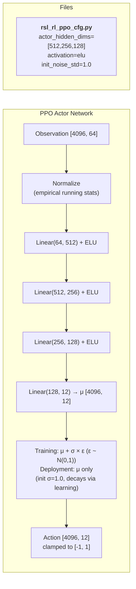
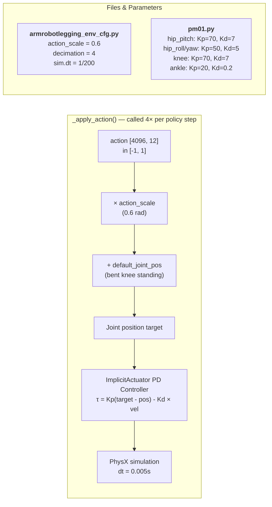
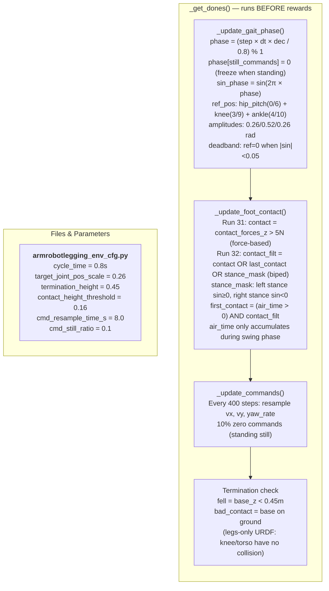
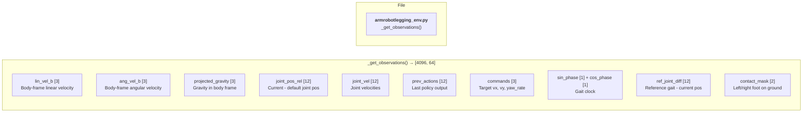
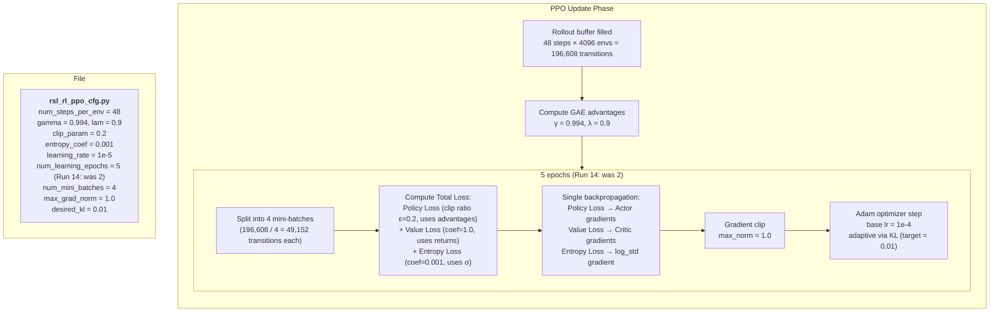
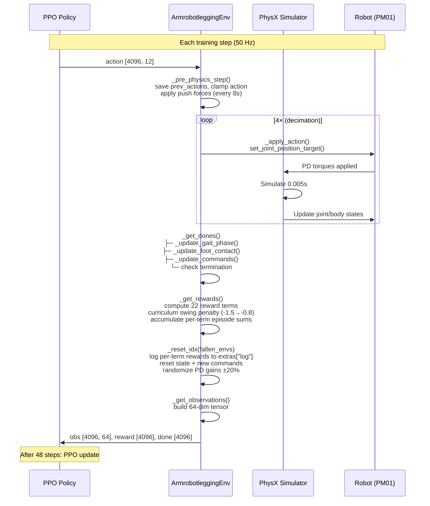

# PM01 Walking — Training Flow

## High-Level Training Loop


## Detailed Step-by-Step with Parameters

### Phase 1: Action Generation



### Phase 2: Action Application (per physics sub-step)



### Phase 3: State Update & Gait Phase



### Phase 4: Observation Construction



### Phase 5: Reward Computation

```mermaid
flowchart TB
    subgraph REWARDS["compute_rewards() → scalar per env"]
        direction TB

        subgraph POS["Positive rewards (clamped ≥ 0)"]
            R1["tracking_lin_vel = 1.4 × exp(-error²/5.0)<br/>Match commanded vx, vy (Run 20: match EngineAI)"]
            R2["tracking_ang_vel = 1.1 × exp(-error²/5.0)<br/>Match commanded yaw rate (Run 20: match EngineAI)"]
            R3["ref_joint_pos = 2.2 × (exp(-2×‖diff‖) - 0.2×clamp(‖diff‖,0,0.5))<br/>Run 29: EngineAI exp-of-norm (less free reward than mean-of-exp)"]
            R4["feet_air_time = 1.5 × Σ(clamp(air_time, 0, 0.5) × first_contact)<br/>Run 32: EngineAI BIPED formula (always positive, capped at 0.5s)"]
            R5["feet_contact_number = 1.4 × mean(match)<br/>Correct stance/swing per phase (Run 20: match EngineAI)"]
            R6["orientation = 1.0 × exp(-roll_pitch_err × 10)<br/>Stay upright (Run 20: match EngineAI)"]
            R7["base_height = 0.2 × exp(-height_err × 100)<br/>Maintain 0.8132m (Run 20: match EngineAI)"]
            R8["vel_mismatch = 0.5 × (low_z_vel + low_xy_angvel)<br/>Minimize parasitic motion (Run 20: match EngineAI)"]
            R9["alive = 0.0<br/>Run 29: REMOVED (not in EngineAI — pure free reward)"]
            R12["default_joint_pos = 0.8 × (exp(-hip_dev×100) - 0.01×norm)<br/>Keep hip pitch/roll near default (Run 20: match EngineAI)"]
            R13["feet_distance = 0.2 × exp(-deviation×100)<br/>Keep feet within [0.15m, 0.8m] (Run 20: match EngineAI)"]
            R_TVH["track_vel_hard = 0.5 × (exp(-err×10) - 0.2×err)<br/>Sharp velocity tracking (Run 20: match EngineAI)"]
            R_LS["low_speed = 0.2 × discrete(-1/+2/-2)<br/>Punish too slow, reward good speed (Run 20: match EngineAI)"]
            R_LV["lat_vel = 0.06 × exp(-lat_error²×10)<br/>Lateral velocity tracking (kept — not in EngineAI)"]
        end

        CLAMP["torch.clamp(sum, min=0.0)"]

        subgraph NEG["Penalties (always applied)"]
            R10["action_smoothness = -0.003 × (term1 + term2 + term3)<br/>term1-3: jerk penalties (Run 20: match EngineAI)"]
            R11["energy = -0.00002 × Σ(action² × |vel|)<br/>Efficiency (kept — EngineAI uses torques instead)"]
            R14["feet_clearance = -1.6 × norm(swing_target - feet_heights)<br/>Force swing foot to lift (Run 26: EngineAI-style accumulated height, target 0.20m)"]
            R15["foot_slip = -0.1 × Σ(√foot_speed × contact)<br/>Penalize sliding on ground (Run 20: match EngineAI)"]
            R16["termination = -0.0 × fell<br/>Fall penalty (Run 20: match EngineAI — disabled)"]
            R_FHM["feet_height_max = -0.6 × Σ(clamp(h-0.25,0))<br/>Penalize over-lifting above 0.25m (Run 26: raised for 0.20m target)"]
            R19["dof_vel = -1e-5 × Σ(joint_vel²)<br/>Penalize joint velocities (Run 20: match EngineAI)"]
            R_SPG["swing_phase_ground = curriculum(-1.5→-0.8) × Σ(swing_mask × contact)<br/>Penalize feet on ground during swing phase (kept — not in EngineAI)"]
            R20["dof_acc = -5e-9 × Σ((Δvel/dt)²)<br/>Penalize joint accelerations (Run 20: match EngineAI)"]
        end

        POS --> CLAMP --> NEG
    end

    subgraph FILES5["Files & Parameters"]
        F5["<b>armrobotlegging_env_cfg.py</b><br/>All rew_* parameters<br/><b>armrobotlegging_env.py</b><br/>compute_rewards()"]
    end
```



### Phase 6: PPO Update



## Complete Parameter Map

### Where every parameter lives

```
┌─────────────────────────────────────────────────────────────────┐
│                        train.py                                  │
│  --task Isaac-PM01-Walking-Direct-v0                            │
│  --num_envs 4096                                                 │
│                                                                  │
│  ┌───────────────────────────────────────────────────────────┐  │
│  │              __init__.py (gym registration)               │  │
│  │  entry_point → ArmrobotleggingEnv                         │  │
│  │  env_cfg     → ArmrobotleggingEnvCfg                      │  │
│  │  agent_cfg   → PM01WalkingPPORunnerCfg                    │  │
│  └───────────────────────────────────────────────────────────┘  │
│                                                                  │
│  ┌─────────────────────┐  ┌────────────────────────────────┐   │
│  │  armrobotlegging_    │  │  rsl_rl_ppo_cfg.py             │   │
│  │  env_cfg.py          │  │                                │   │
│  │                      │  │  Network:                      │   │
│  │  SIMULATION:         │  │    [512, 256, 128] ELU         │   │
│  │    dt = 1/200        │  │    noise_std = 1.0             │   │
│  │    decimation = 4    │  │    obs normalization = True    │   │
│  │                      │  │                                │   │
│  │  SPACES:             │  │  PPO:                          │   │
│  │    action = 12       │  │    γ = 0.994, λ = 0.9         │   │
│  │    obs = 64          │  │    lr = 1e-5 (adaptive)        │   │
│  │                      │  │    clip = 0.2                  │   │
│  │  GAIT:               │  │    entropy = 0.001             │   │
│  │    cycle = 0.8s      │  │    epochs = 5                  │   │
│  │    scale = 0.26 rad  │  │    mini-batches = 4            │   │
│  │                      │  │    steps/env = 48              │   │
│  │  COMMANDS:            │  │    max_iterations = 10000      │   │
│  │    vx: [0.3, 1] m/s   │  │                                │   │
│  │    vy: [-0.2, 0.2]   │  └────────────────────────────────┘   │
│  │    yaw: [-0.5, 0.5]│                                       │
│  │    resample: 8s       │  ┌────────────────────────────────┐   │
│  │    still: 10%         │  │  pm01.py (robot config)        │   │
│  │                      │  │                                │   │
│  │  REWARDS (EngineAI):   │  │  PD Gains:                     │   │
│  │    lin_vel: 1.4        │  │    hip_pitch: Kp=70, Kd=7     │   │
│  │    ang_vel: 1.1        │  │    knee: Kp=70, Kd=7          │   │
│  │    ref_pos: 2.2        │  │    ankle: Kp=20, Kd=0.2       │   │
│  │    air_time: 1.5       │  │                                │   │
│  │    contact: 1.4        │  │  Effort limits:                │   │
│  │    orient: 1.0         │  │    hip: 164 Nm                 │   │
│  │    height: 0.2         │  │    knee: 164 Nm                │   │
│  │    vel_mis: 0.5        │  │    ankle: 52 Nm                │   │
│  │    alive: 0.03         │  │                                │   │
│  │    smooth: -0.003      │  │  Init: 0.9m, knees bent        │   │
│  │    energy: -2e-5       │  │  URDF: pm01_only_legs_simple_  │   │
│  │        collision.urdf           │   │
│  │    clearance: -1.6     │  │                                │   │
│  │    default_pos: 0.8    │  │                                │   │
│  │    feet_dist: 0.2      │  │                                │   │
│  │    foot_slip: -0.1     │  │                                │   │
│  │    term: -0.0          │  │                                │   │
│  │    track_hard: 0.5     │  │                                │   │
│  │    low_speed: 0.2      │  │                                │   │
│  │    dof_vel: -1e-5      │  │                                │   │
│  │    dof_acc: -5e-9      │  │                                │   │
│  │    lat_vel: 0.06       │  └────────────────────────────────┘   │
│  │                      │                                       │
│  │  TERMINATION:         │                                       │
│  │    height < 0.45m     │                                       │
│  │    body contact       │                                       │
│  │    timeout: 20s       │                                       │
│  └─────────────────────┘                                       │
└─────────────────────────────────────────────────────────────────┘
```

## IsaacLab Step Execution Order



## Hyperparameter Reference

### 1. Simulation & Timing (`armrobotlegging_env_cfg.py`)

| Param | Value | Purpose |
|-------|-------|---------|
| `dt` | 1/200 (0.005s) | Physics timestep — how often PhysX solves. Smaller = more accurate but slower |
| `decimation` | 4 | Physics steps per policy step. Policy runs at 200/4 = **50 Hz** |
| `episode_length_s` | 20.0 | Max episode duration before timeout reset |
| `num_envs` | 4096 | Parallel environments — more = faster data collection, better gradient estimates |
| `env_spacing` | 2.5m | Distance between robot instances in the grid |

### 2. Action & Control (`armrobotlegging_env_cfg.py` + `pm01.py`)

| Param | Value | Purpose |
|-------|-------|---------|
| `action_space` | 12 | Number of leg joints the policy controls (6 per leg) |
| `action_scale` | 0.6 rad | Maps policy output [-1,1] to joint position offset. Run 38: 0.5→0.6 for more expressive gait |
| hip_pitch Kp/Kd | 70 / 7 | Stiffness/damping for hip forward-backward swing. High = stiff tracking |
| hip_roll Kp/Kd | 50 / 5 | Stiffness/damping for hip lateral tilt |
| hip_yaw Kp/Kd | 50 / 5 | Stiffness/damping for hip rotation |
| knee Kp/Kd | 70 / 7 | Stiffness/damping for knee bend |
| ankle Kp/Kd | 20 / 0.2 | Stiffness/damping for ankle. Very low — causes vibration issues |

### 3. Gait Reference (`armrobotlegging_env_cfg.py`)

| Param | Value | Purpose |
|-------|-------|---------|
| `cycle_time` | 0.8s | Full gait cycle duration (left swing + right swing). Matches EngineAI |
| `target_joint_pos_scale` | 0.17 rad | Amplitude of sinusoidal gait reference for hip/ankle. Knee gets 2x (0.34 rad). Run 19: reduced from 0.26 |
| `target_feet_height` | 0.12m | Target swing foot height. Run 38: raised from 0.10 for higher foot lifts |
| `max_feet_height` | 0.15m | Max allowed swing foot height. Run 27: match target + margin |

### 4. Velocity Commands (`armrobotlegging_env_cfg.py`)

| Param | Value | Purpose |
|-------|-------|---------|
| `cmd_lin_vel_x_range` | (0.3, 1.0) m/s | Forward speed range. Min 0.3 prevents standing-still exploit |
| `cmd_lin_vel_y_range` | (-0.2, 0.2) m/s | Lateral speed range. Small to simplify task |
| `cmd_ang_vel_z_range` | (-0.5, 0.5) rad/s | Yaw rate range. Reduced to focus on straight walking |
| `cmd_resample_time_s` | 8.0s | How often new random commands are sampled |
| `cmd_still_ratio` | 0.1 | 10% of commands are zero (standing still). Robot must learn both walking and standing |

### 5. Contact Detection (`armrobotlegging_env_cfg.py`)

| Param | Value | Purpose |
|-------|-------|---------|
| `contact_force_threshold` | 5.0 N | Run 31: Force-based contact detection (EngineAI). Replaces z-height (0.16m) which was unreliable |
| `foot_body_names` | link_ankle_roll_l/r | Which bodies to check for foot contact |

### 6. Termination (`armrobotlegging_env_cfg.py`)

| Param | Value | Purpose |
|-------|-------|---------|
| `termination_height` | 0.45m | Reset if robot base drops below this — reverted from 0.65 (Run 37: too strict caused standing still) |
| `base_height_target` | 0.8132m | Nominal standing height — used by base_height reward |
| `termination_contact_body_names` | link_base | Reset if these bodies touch the ground (torso fell) |

### 7. Domain Randomization (`armrobotlegging_env_cfg.py`)

| Param | Value | Purpose |
|-------|-------|---------|
| `push_robots` | True | Enable random velocity impulses to force reactive stepping |
| `push_interval_s` | 8.0s | How often pushes occur (Run 35: EngineAI value for more reactive stepping) |
| `max_push_vel_xy` | 1.0 m/s | Max linear push magnitude (Run 33: match EngineAI) |
| `max_push_ang_vel` | 0.6 rad/s | Max angular push magnitude (Run 33: match EngineAI) |
| `pd_gains_rand` | True | Randomize PD gains per DOF per reset (Run 18) |
| `stiffness_multi_range` | (0.8, 1.2) | Stiffness multiplier range (±20%) |
| `damping_multi_range` | (0.8, 1.2) | Damping multiplier range (±20%) |

### 8. Curriculum (`armrobotlegging_env_cfg.py`)

| Param | Value | Purpose |
|-------|-------|---------|
| `swing_penalty_start` | -1.5 | Initial swing penalty — aggressive, forces foot lifting |
| `swing_penalty_end` | -0.8 | Final swing penalty — relaxed, allows survival |
| `swing_curriculum_steps` | 144,000 | Steps over which to anneal (linear). ~3000 training iterations |

### 9. Rewards — Positive (encourage good behavior)

| Param | Value | Formula | Purpose |
|-------|-------|---------|---------|
| `rew_tracking_lin_vel` | 1.4 | `w * exp(-error²/sigma)` | Run 36: FULL EngineAI (forward drive) |
| `rew_tracking_ang_vel` | 1.1 | `w * exp(-error²/sigma)` | Run 36: FULL EngineAI |
| `rew_tracking_sigma` | 5.0 | (used in above) | Sharpness of tracking reward (EngineAI value) |
| `rew_ref_joint_pos` | 1.47 | `w * (exp(-2*‖diff‖) - 0.2*clamp(‖diff‖,0,0.5))` | Run 36: reverted /1.5 (2.2 caused standing) |
| `rew_feet_air_time` | 1.0 | `w * sum(clamp(air_time, 0, 0.5) * first_contact)` | Run 34: EngineAI 1.5 / 1.5 (biped formula) |
| `rew_feet_contact_number` | 0.93 | `w * mean(match)` | Run 34: EngineAI 1.4 / 1.5 |
| `rew_orientation` | 1.0 | `w * exp(-roll_pitch_err*10)` | Run 35: FULL EngineAI (stability) |
| `rew_base_height` | 0.2 | `w * exp(-height_err*100)` | Run 35: FULL EngineAI (stability) |
| `rew_vel_mismatch` | 0.5 | `w * 0.5*(low_z + low_xy_ang)` | Run 35: FULL EngineAI (stability) |
| `rew_alive` | 0.0 | `w * 1.0` | Disabled (not in EngineAI) |
| `rew_default_joint_pos` | 0.53 | `w * (exp(-hip_dev*100) - 0.01*norm)` | Run 34: EngineAI 0.8 / 1.5 |
| `rew_feet_distance` | 0.13 | `w * exp(-deviation*100)` | Run 34: EngineAI 0.2 / 1.5 |
| `rew_track_vel_hard` | 0.5 | `w * (exp(-err*10) - 0.2*err)` | Run 35: FULL EngineAI (stability) |
| `rew_low_speed` | 0.2 | `w * discrete(-1/+2/-2)` | Run 35: FULL EngineAI (stability) |
| `rew_lat_vel` | 0.04 | `w * exp(-lat_err²*10)` | Run 34: 0.06 / 1.5 |

### 10. Rewards — Penalties (discourage bad behavior)

| Param | Value | Formula | Purpose |
|-------|-------|---------|---------|
| `rew_action_smoothness` | -0.002 | `w * (jerk + 2nd_order + mag)` | Run 34: EngineAI -0.003 / 1.5 |
| `rew_energy` | -0.000067 | `w * sum(action² * \|vel\|)` | Run 34: EngineAI -0.0001 / 1.5 |
| `rew_feet_clearance` | -1.6 | `w * norm(target_h - feet_heights)` | Run 38: FULL EngineAI (was -1.07) |
| `rew_feet_height_max` | -0.6 | `w * sum(clamp(h - 0.18, 0))` | Run 38: FULL EngineAI (was -0.4) |
| `rew_foot_slip` | -0.067 | `w * sum(sqrt(speed) * contact)` | Run 34: EngineAI -0.1 / 1.5 |
| `rew_termination` | -0.0 | `w * fell` | Disabled (EngineAI uses -0.0) |
| `rew_swing_phase_ground` | 0.0 | `w * sum(swing_mask * contact)` | Disabled (not in EngineAI) |
| `rew_dof_vel` | -6.7e-6 | `w * sum(vel²)` | Run 34: EngineAI -1e-5 / 1.5 |
| `rew_dof_acc` | -3.3e-9 | `w * sum(acc²)` | Run 34: EngineAI -5e-9 / 1.5 |
| `min_feet_dist` | 0.15m | (in feet_distance) | Minimum allowed distance between feet |
| `max_feet_dist` | 0.8m | (in feet_distance) | Maximum allowed distance between feet |

### Reward & Penalty Ranges — What the Robot Needs to Achieve

All values shown are **per policy step** (before episode accumulation). Terms 1-14 are summed then **clamped ≥ 0**. Terms 15-23 are always ≤ 0 and subtracted after the clamp.

| # | Term | Weight | Formula | Rewarded When | Penalized When |
|---|------|--------|---------|---------------|----------------|
| 1 | **tracking_lin_vel** | 1.4 | `w × exp(-error²/σ)` | Moving at commanded vx, vy (max 1.4 at error=0) | Moving different speed/direction (→0 as error grows) |
| 2 | **tracking_ang_vel** | 1.1 | `w × exp(-error²/σ)` | Turning at commanded yaw rate (max 1.1) | Turning wrong speed (→0 as error grows) |
| 3 | **ref_joint_pos** | 2.2 | `w × (exp(-2×‖diff‖) - 0.2×clamp(‖diff‖,0,0.5))` | All 12 joints match gait reference (max ~2.0 at diff=0). Run 29: exp-of-norm gives ~0.3 free (vs 0.9 from old mean-of-exp) | Joints far from ref: norm>2 → exp≈0, penalty -0.2×0.5=-0.1 |
| 4 | **feet_air_time** | 1.5 | `w × Σ(clamp(air_time,0,0.5) × first_contact)` | Run 32: EngineAI BIPED formula. ANY step → positive reward (capped at 0.5s). Air time only accumulates during swing phase (stance_mask in contact_filt) | Short step (0.1s) → +0.15. Good step (0.5s+) → +0.75 (capped) |
| 5 | **contact_pattern** | 1.4 | `w × mean(match=+1, miss=-0.3)` | Left on ground when sin≥0, right when sin<0 (max 1.4) | Wrong phase: both wrong → -0.42 |
| 6 | **orientation** | 1.0 | `w × exp(-roll_pitch_err×10)` | Body upright, roll=0, pitch=0 (max 1.0) | Tilted (15° → half lost; 30° → nearly gone) |
| 7 | **base_height** | 0.2 | `w × exp(-\|h-target\|×100)` | Base at 0.8132m exactly (max 0.2) | ±0.023m off → 90% lost. Very sharp |
| 8 | **vel_mismatch** | 0.5 | `w × 0.5(exp_z + exp_xy)` | No vertical bouncing or sideways rocking (max 0.5) | Bouncing up/down or rocking side to side (→0) |
| 9 | **alive** | 0.0 | `w × 1.0` | Run 29: REMOVED (not in EngineAI — pure free reward) | N/A |
| 10 | **default_joint_pos** | 0.8 | `w × (exp(-hip×100) - 0.01×norm)` | Hip pitch/roll near default pose (max ~0.8) | Hip dev > 0.05 rad: exp≈0. Can go negative from linear norm |
| 11 | **feet_distance** | 0.2 | `w × 0.5(exp_min + exp_max)` | Feet 0.15–0.8m apart (max 0.2) | Feet too close (<0.15m) or too far (>0.8m) → 0 |
| 12 | **track_vel_hard** | 0.5 | `w × (exp(-err×10) - 0.2×err)` | Velocity error near 0 (max ~0.5) | Error > ~0.6 m/s: goes negative |
| 13 | **low_speed** | 0.2 | `w × discrete(-1/+2/-2)` | Speed 50-120% of command → +0.4 | <50% → -0.2; opposite direction → -0.4 (worst) |
| 14 | **lat_vel** | 0.06 | `w × exp(-lat_err²×10)` | Lateral vel matches command (max 0.06) | Lat error grows → 0 |
| 15 | **action_smoothness** | -0.003 | `w × (jerk + 2nd_order + 0.05×mag)` | Smooth actions (→0 penalty) | Jerky/oscillating actions (unbounded penalty) |
| 16 | **energy** | -2e-5 | `w × Σ(action²×\|vel\|)` | Low torques or low velocity (→0) | High torques × high velocities (unbounded) |
| 17 | **feet_clearance** | -1.6 | `w × ‖target_h - feet_heights‖` | Swing foot at target (swing_curve × 0.20m) → 0 | Too low (shuffling) OR too high. Uses accumulated swing height (Run 26) |
| 18 | **feet_height_max** | -0.24 | `w × Σ(clamp(h-0.25, min=0))` | Swing foot ≤ 0.25m → 0 penalty | >0.25m: over-lifting penalty (Run 26) |
| 19 | **foot_slip** | -0.1 | `w × Σ(√speed × contact)` | Feet stationary on ground → 0 | Feet sliding while in contact (unbounded) |
| 20 | **termination** | -0.0 | `w × fell` | Disabled (EngineAI uses -0.0) | — |
| 21 | **swing_phase_ground** | curriculum(-1.5→-0.8) | `w × Σ(swing_mask × contact)` | Swing foot in air during swing phase → 0 | Foot on ground during swing. Both feet: up to -3.0/step (early) |
| 22 | **dof_vel** | -1e-5 | `w × Σ(vel²)` | Low joint velocities → 0 | High velocities/vibration |
| 23 | **dof_acc** | -5e-9 | `w × Σ(acc²)` | Constant velocities → 0 | Rapid velocity changes |

#### Sweet Spot Summary — What "Good Walking" Looks Like

```
Foot height during swing (accumulated height from contact, Run 26+):
  0.00m ─── shuffling / just landed (clearance penalty, swing_ground penalty)
  0.05m ─── half target (moderate clearance penalty)
  0.10m ─── ★ TARGET (zero clearance penalty, max reward zone)
  0.15m ─── CEILING (feet_height_max penalty starts)
  0.20m ─── over-lifting (both clearance AND height_max penalty)

Base height:
  0.45m ─── TERMINATED (fell — episode ends)
  0.70m ─── 10% of base_height reward (too low)
  0.79m ─── 50% of base_height reward
  0.8132m ── ★ TARGET (max base_height reward)
  0.84m ─── 50% of base_height reward (too high)
  0.90m ─── 10% of base_height reward

Forward velocity (if commanded 0.7 m/s):
  <0.0 m/s ── low_speed: -0.6 (wrong direction!)
  0.0-0.35 ── low_speed: -0.3 (too slow, <50% command)
  0.35-0.84 ─ ★ low_speed: +0.6 (desired range, 50-120% command)
  0.70 m/s ── ★ tracking_lin_vel: 0.28 (perfect match)
  >0.84 ───── low_speed: 0 (too fast but no penalty from low_speed)

Body orientation:
  roll=0, pitch=0 ── ★ orientation: 0.4 (perfectly upright)
  tilt 5° (0.087 rad) ── orientation: ~0.37 (small loss)
  tilt 15° (0.26 rad) ── orientation: ~0.20 (half lost)
  tilt 30° (0.52 rad) ── orientation: ~0.03 (nearly gone)
```

### 11. PPO Algorithm (`rsl_rl_ppo_cfg.py`)

| Param | Value | Purpose |
|-------|-------|---------|
| `actor_hidden_dims` | [512, 256, 128] | Actor network size — maps 64-dim obs to 12-dim action |
| `critic_hidden_dims` | [768, 256, 128] | Critic network size — larger to better estimate value function |
| `activation` | ELU | Activation function. Smooth, handles negative values |
| `init_noise_std` | 1.0 | Initial exploration noise. Decays during training (0.1 = converged) |
| `learning_rate` | 1e-5 | Adam optimizer LR. 1e-3/1e-4 were unstable |
| `schedule` | adaptive | LR adjusts based on KL divergence vs `desired_kl` |
| `desired_kl` | 0.01 | Target KL divergence — if too high, LR decreases; if too low, increases |
| `gamma` | 0.994 | Discount factor. High = care about long-term rewards |
| `lam` | 0.9 | GAE lambda. Bias-variance tradeoff for advantage estimation |
| `clip_param` | 0.2 | PPO clipping — limits how much policy can change per update |
| `entropy_coef` | 0.001 | Entropy bonus — encourages exploration. 0.005 was too high |
| `value_loss_coef` | 1.0 | Weight of critic loss in total loss |
| `num_learning_epochs` | 5 | How many times to reuse collected data per iteration |
| `num_mini_batches` | 4 | Split data into 4 chunks per epoch (49,152 transitions each) |
| `num_steps_per_env` | 48 | Policy steps collected per env per iteration |
| `max_iterations` | 10000 | Total training iterations |
| `save_interval` | 200 | Save checkpoint every N iterations |
| `max_grad_norm` | 1.0 | Gradient clipping — prevents catastrophic updates |
| `empirical_normalization` | True | Normalize observations using running mean/std |
